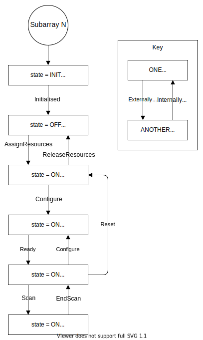

SDP Subarray Device
===================

Introduction
------------

The SDP Subarray Tango device is the principal means by which processing is
initiated in SDP. The present implementation only performs real-time
processing.

State Model
-----------

The SDP Subarray device will eventually implement the `Subarray state model
<https://confluence.skatelescope.org/display/SE/Subarray+State+Model>`_. The
present partial implementation is as follows:

Behaviour
---------

The interaction between TMC (Telescope Manager Control) and the SDP Subarray device is shown below. The
SDP Subarray device receives commands from the TMC SDP Subarray leaf node,
and the consequent changes to the state of SDP are reported in the device
attributes.

.. image:: ../images/sdp_subarray_interaction_tango.svg
   :align: center

Interface
---------

Attributes
^^^^^^^^^^

==================== ====== ========== =========================== ===========
Attribute            Type   Read/Write Values                      Description
==================== ====== ========== =========================== ===========
serverVersion        String Read       Semantic version            Subarray device server version
-------------------- ------ ---------- --------------------------- -----------
obsState             Enum   Read-write :ref:`subarray_obsstate`    Subarray observation state
-------------------- ------ ---------- --------------------------- -----------
adminMode            Enum   Read-write :ref:`subarray_adminmode`   Subarray admin mode
-------------------- ------ ---------- --------------------------- -----------
healthState          Enum   Read       :ref:`subarray_healthstate` Subarray health state
-------------------- ------ ---------- --------------------------- -----------
receiveAddresses     String Read       JSON object                 Host addresses for receiving visibilities
-------------------- ------ ---------- --------------------------- -----------
processingBlockState String Read       JSON object                 State of associated real-time Processing Block
==================== ====== ========== =========================== ===========

.. _subarray_obsstate:

obsState values
"""""""""""""""

=============== ===========
obsState        Description
=============== ===========
IDLE (0)
--------------- -----------
CONFIGURING (1)
--------------- -----------
READY (2)
--------------- -----------
SCANNING (3)
--------------- -----------
PAUSED (4)
--------------- -----------
ABORTED (5)
--------------- -----------
FAULT (6)
=============== ===========

.. _subarray_adminmode:

adminMode values
""""""""""""""""

=============== ===========
adminMode       Description
=============== ===========
OFFLINE (0)
--------------- -----------
ONLINE (1)
--------------- -----------
MAINTENANCE (2)
--------------- -----------
NOT_FITTED (3)
--------------- -----------
RESERVED (4)
=============== ===========

.. _subarray_healthstate:

healthState values
""""""""""""""""""

============ ===========
healthState  Description
============ ===========
OK (0)
------------ -----------
DEGRADED (1)
------------ -----------
FAILED (2)
------------ -----------
UNKNOWN (3)
============ ===========

Commands
^^^^^^^^

================ ============= =========== ======
Command          Argument type Return type Action
================ ============= =========== ======
AssignResources  String        None        Assign resources to this Subarray. This sets DeviceState to ON, but it is otherwise a no-op for SDP.
ReleaseResources String        None        Release resources assigned to the Subarray. This sets DeviceState to OFF, but it is otherwise a no-op for SDP.
Configure        String (JSON) None        :ref:`Configure processing for this Subarray<subarray_configure>`.
ConfigureScan    String (JSON) None        :ref:`Update processing configuration for the next scan<subarray_configurescan>`.
Scan             None          None        Begin a scan. Sets obsState to SCANNING. (BeginScan is a duplicate of this command.)
EndScan          None          None        End a scan. Sets obsState to READY.
EndSB            None          None        End the Scheduling Block. Sets obsState to IDLE.
================ ============= =========== ======

.. _subarray_configure:

Configure command
"""""""""""""""""

The argument of the Configure command is a JSON object describing the
processing to be done for the Subarray. It contains a Processing Block
that defines the workflow to be run and the parameters to be passed
to the workflow.

An example of the argument:

.. code-block:: json

    {
        "configure": {
            "id": "PB_27062019_0001_ingest",
            "sbiId": "SBI_27062019_0001",
            "cspCbfOutlinkAddress": "mid_csp/elt/subarray01/cbfOutLink",
            "workflow": {
                "type": "realtime",
                "id": "vis_receive",
                "version": "0.1.0"
            },
            "parameters": {
                "numAntennas": 4,
                "numChannels": 372,
                "numPolarisations": 4,
                "freqStartHz": 0.35e9,
                "freqEndHz": 1.05e9,
                "fields": {
                    "0": { "system": "ICRS", "name": "", "ra": "", "dec": "" },
                    "1": { "system": "ICRS", "name": "", "ra": "", "dec": "" }
                }
            },
            "scanParameters": {
                "12345": {
                    "fieldId": 0,
                    "interval": 0.140
                }
            }
        }
    }

.. _subarray_configurescan:

ConfigureScan command
"""""""""""""""""""""

The ConfigureScan command is interpreted as passing late-binding scan-specific
information to the workflow that was instantiated in response to the Configure
command. The argument is a JSON object containing the an entry to be added to
the scanParameters in the Processing Block.

An example of the argument:

.. code-block:: json

    {
        "scanId": 12346,
        "fieldId": 1,
        "interval": 0.140
    }

Python API
----------

.. automodule:: SDPSubarray
    :members:
    :undoc-members:
